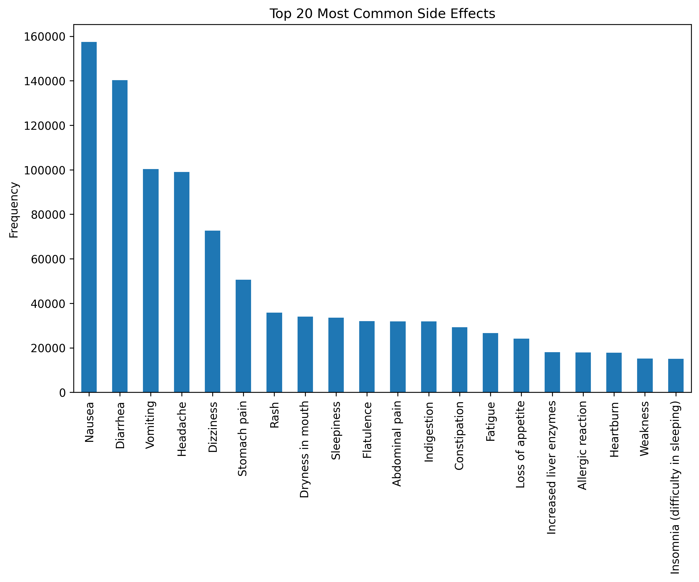

# Medicines Analysis
Analysis of Side Effects, Substitutes, and Drug Classes (250k Records from Kaggle)

## Project Goal
The goal of this project is to analyze 250k medicine records from Kaggle in order to:
- Identify the most common side effects
- Explore which medicines are associated with specific effects (e.g. nausea, diarrhea)
- Understand relationships between **uses** and **action classes**
- Find which chemical classes are most “toxic” (many side effects)
- Investigate which classes are habit-forming

## Dataset
- Source: [Kaggle – 250k Medicines Usage, Side Effects and Substitutes](https://www.kaggle.com/datasets/shudhanshusingh/250k-medicines-usage-side-effects-and-substitutes)  
- ~248,000 rows, 58 columns  
- Fields: name, substitutes, side effects, uses, classes  

## Project Structure
- `data/` – dataset and metadata  
- `notebooks/` – Jupyter notebooks with EDA and analysis  
- `images/` – visualizations (charts, wordclouds)  
- `dashboard/` – Looker Studio dashboard screenshots and links  

## Research Questions
1. What side effects are most frequent?  
2. Which medicines are associated with specific side effects (nausea, diarrhea, etc.)?  
3. Which action classes are most common for different uses?  
4. Which chemical classes are linked to the highest number of side effects?  
5. Which chemical classes are most frequently habit-forming?  

## Results

### Top 20 Most Common Side Effects

