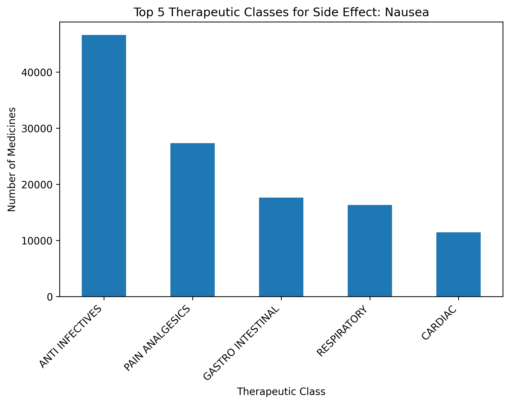
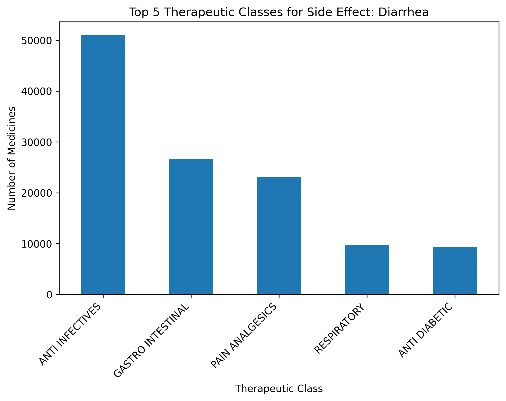
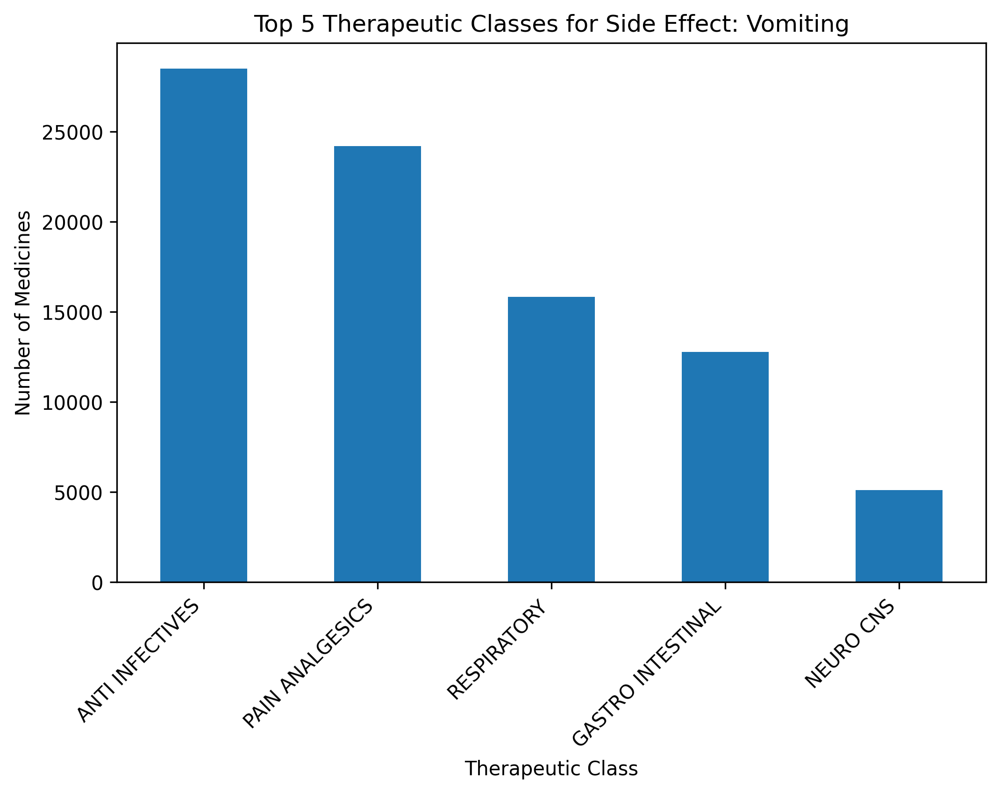
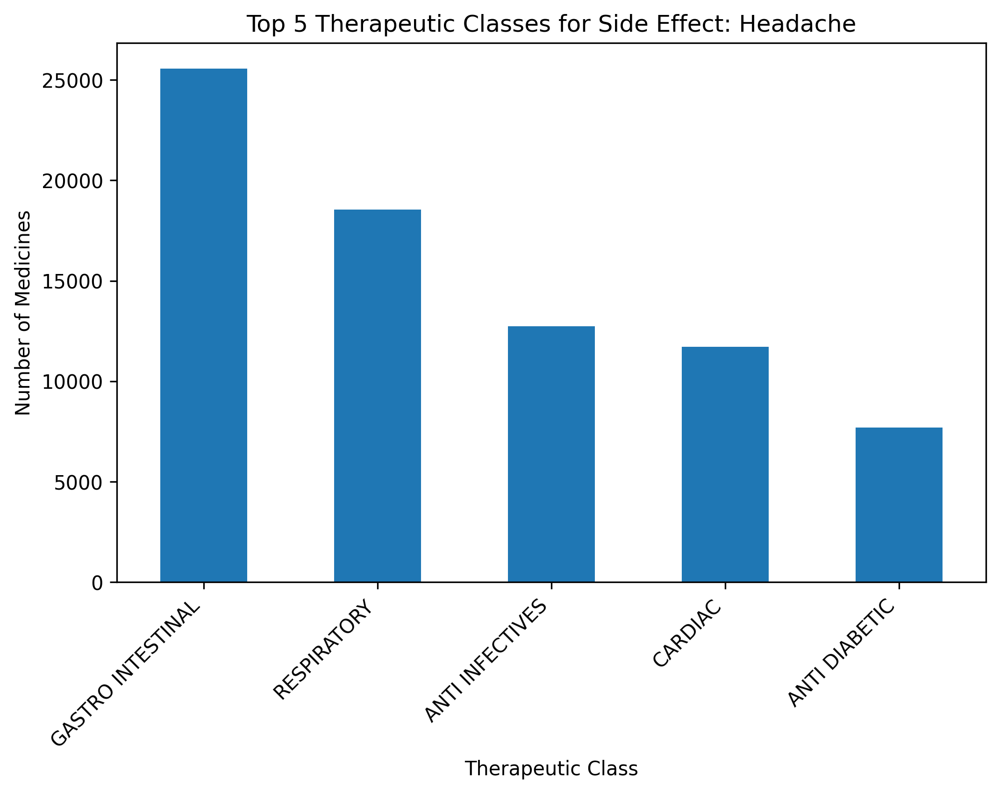
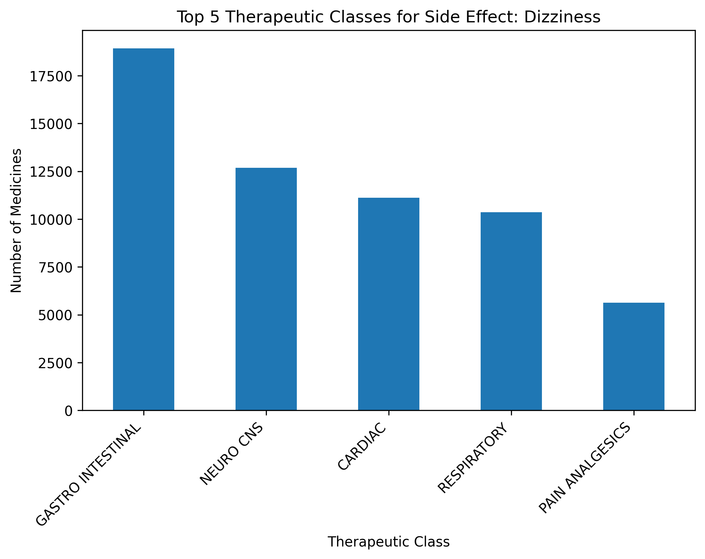

# Medicines Analysis
Analysis of Side Effects, Substitutes, and Drug Classes (250k Records from Kaggle)

## Project Goal
The goal of this project is to analyze 250k medicine records from Kaggle in order to:
- Identify the most common side effects
- Find which chemical classes are most “toxic” (many side effects)
- Investigate which classes are habit-forming

## Dataset
- Source: [Kaggle – 250k Medicines Usage, Side Effects and Substitutes](https://www.kaggle.com/datasets/shudhanshusingh/250k-medicines-usage-side-effects-and-substitutes)  
- ~248,000 rows, 58 columns  
- Fields: name, substitutes, side effects, uses, classes  

## Project Structure
- `data/` – dataset and metadata  
- `notebooks/` – Jupyter notebooks with EDA and analysis  
- `images/` – visualizations (charts, wordclouds)  
- `dashboard/` – Looker Studio dashboard screenshots and links  

## Research Questions
1. What side effects are most frequent?   
2. Which chemical classes are linked to the highest number of side effects?  
3. Which chemical classes are most frequently habit-forming?  

## Results

### Top 20 Most Common Side Effects

### Top 5 Side Effects and Their Associated Therapeutic Classes

This section explores the five most common side effects across the dataset and identifies the top five therapeutic classes associated with each effect.  

#### Nausea
  
*Nausea is most frequently linked with **ANTI INFECTIVES** and **RESPIRATORY** therapeutic classes, suggesting that antibiotics and respiratory treatments often report this side effect.*

#### Diarrhea
  
*Diarrhea is commonly associated with **ANTI INFECTIVES**, indicating that many antibacterial treatments list it as a side effect.*

#### Vomiting
  
*Vomiting appears across several therapeutic classes, with a strong presence in **ANTI INFECTIVES** and **CARDIAC** medicines.*

#### Headache
  
*Headache is frequently reported in **RESPIRATORY** and **CARDIAC** classes, which may reflect side effects of antihistamines and heart medications.*

#### Dizziness
  
*Dizziness is most often associated with **CARDIAC** and **RESPIRATORY** classes, highlighting possible links to blood pressure and antihistamine treatments.*

### Summary Table: Top 5 Side Effects × Therapeutic Classes

Below is a preview of the first 10 rows of the summary table.  
The full table is available in [Download summary table (CSV)](data/top5_sideeffects_vs_classes.csv)

| Side Effect   | Therapeutic Class   |   Count |
|:--------------|:--------------------|--------:|
| Nausea        | ANTI INFECTIVES     |   46597 |
| Nausea        | PAIN ANALGESICS     |   27357 |
| Nausea        | GASTRO INTESTINAL   |   17615 |
| Nausea        | RESPIRATORY         |   16310 |
| Nausea        | CARDIAC             |   11440 |
| Diarrhea      | ANTI INFECTIVES     |   51066 |
| Diarrhea      | GASTRO INTESTINAL   |   26581 |
| Diarrhea      | PAIN ANALGESICS     |   23103 |
| Diarrhea      | RESPIRATORY         |    9683 |
| Diarrhea      | ANTI DIABETIC       |    9374 |

**Key Findings:**
- Nausea and Diarrhea are most strongly associated with the **ANTI INFECTIVES** class, reflecting common side effects of antibiotics.  
- Vomiting is also heavily represented in **ANTI INFECTIVES**, but appears in some **CARDIAC** medicines as well.  
- Headache and Dizziness occur across multiple classes, but are particularly frequent in **RESPIRATORY** and **CARDIAC** medicines.  
- Overall, **ANTI INFECTIVES** dominate the side-effect landscape, highlighting their broad impact on patients.

