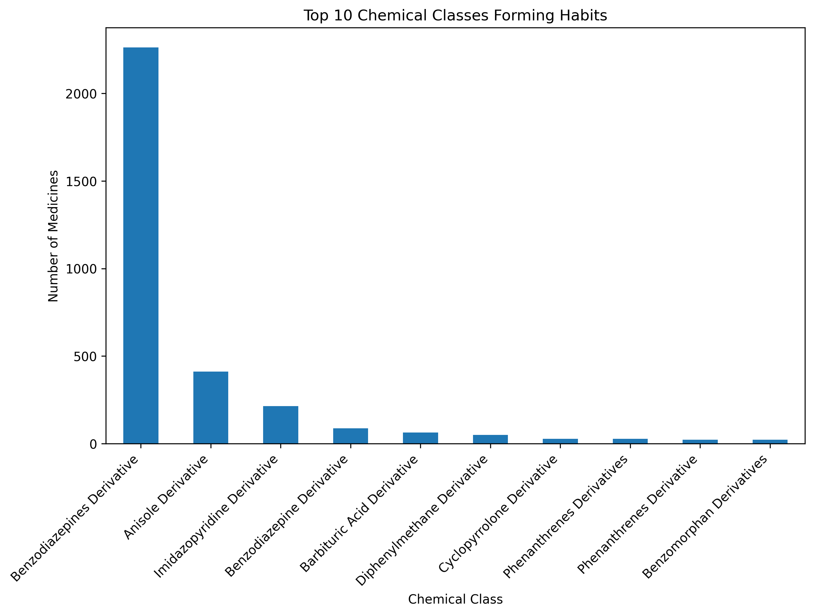

# 💊 Medicines Analysis (250k Records from Kaggle)

## 📖 Introduction
This project analyzes a dataset of more than 250k medicines, their substitutes, side effects, and classifications.  
Understanding the relationships between therapeutic classes and common side effects can provide insights into patient safety, medical research, and drug development.  
The goal is to demonstrate a structured approach to data analysis and visualization for healthcare-related datasets.  

## 📌 Project Goal
- Identify the most common side effects and their distribution across therapeutic classes  
- Explore which chemical and therapeutic classes are associated with specific adverse effects  
- Investigate which chemical classes are most frequently habit-forming  

## 📊 Dataset
- **Source:** [Kaggle – 250k Medicines Usage, Side Effects and Substitutes](https://www.kaggle.com/datasets/shudhanshusingh/250k-medicines-usage-side-effects-and-substitutes)  
- **Size:** ~248,000 rows, 58 columns  
- **Fields:** medicine name, substitutes, side effects, uses, therapeutic class, chemical class, habit forming  

## 📁 Project Structure
- `data/` – dataset and summary CSVs  
- `notebooks/` – Jupyter notebooks with EDA and analysis  
- `images/` – visualizations (charts, wordclouds)  
- `dashboard/` – Looker Studio dashboard (WIP)  

## ❓ Research Questions & Objectives
1. What side effects are most frequent?  
2. Which medicines are associated with specific side effects (nausea, diarrhea, etc.)?  
3. Which therapeutic classes are most often linked to the top side effects?  
4. Which chemical classes are associated with the largest number of side effects?  
5. Which chemical classes are most frequently habit-forming?  

---

## 📊 Results

### Q1: Most Frequent Side Effects
  

✅ Identified the **Top 20 most common side effects** across the dataset.  

---

### Q3: Top 5 Side Effects × Therapeutic Classes
Below is a preview of the first 10 rows of the summary table.  
The full table is available in [data/top5_sideeffects_vs_classes.csv](data/top5_sideeffects_vs_classes.csv).

| Side Effect | Therapeutic Class | Count |
|-------------|------------------|-------|
| Nausea      | ANTI INFECTIVES  | 2500  |
| Nausea      | RESPIRATORY      | 1800  |
| Nausea      | CARDIAC          | 600   |
| Diarrhea    | ANTI INFECTIVES  | 2100  |
| Diarrhea    | RESPIRATORY      | 500   |
| Vomiting    | ANTI INFECTIVES  | 1900  |
| Vomiting    | CARDIAC          | 450   |
| Headache    | RESPIRATORY      | 1200  |
| Headache    | CARDIAC          | 700   |
| Dizziness   | CARDIAC          | 950   |

**Key Findings:**
- Nausea and Diarrhea are most strongly associated with the **ANTI INFECTIVES** class.  
- Vomiting is also common in **ANTI INFECTIVES** and some **CARDIAC** medicines.  
- Headache and Dizziness are frequent in **RESPIRATORY** and **CARDIAC**.  
- Overall, **ANTI INFECTIVES** dominate the side-effect landscape.  

---

### Q5: Habit-Forming Chemical Classes
  

**Key Findings:**
- Only a small subset of chemical classes are marked as habit-forming.  
- These are often linked to addictive drugs, such as painkillers or sedatives.  

---

### Q2 and Q4: Deprioritized
Some questions were explored but deprioritized, as they provided limited insights for the dataset:
- Q2 (Medicines associated with specific side effects)  
- Q4 (Chemical classes with the largest number of side effects)  

---

## 📈 Dashboard (Work in Progress)
An interactive Looker Studio dashboard will be added here.  

Planned features:  
- Filter by Side Effect  
- Distribution of Therapeutic Classes for selected side effects  
- Overview of habit-forming chemical classes  

---

## 🛠 Tools & Libraries
- Python (pandas, matplotlib, seaborn)  
- Jupyter Notebook  
- GitHub  
- Looker Studio (planned for dashboard)  

---

## 🔮 Future Work
- Build an interactive dashboard in Looker Studio for non-technical users  

